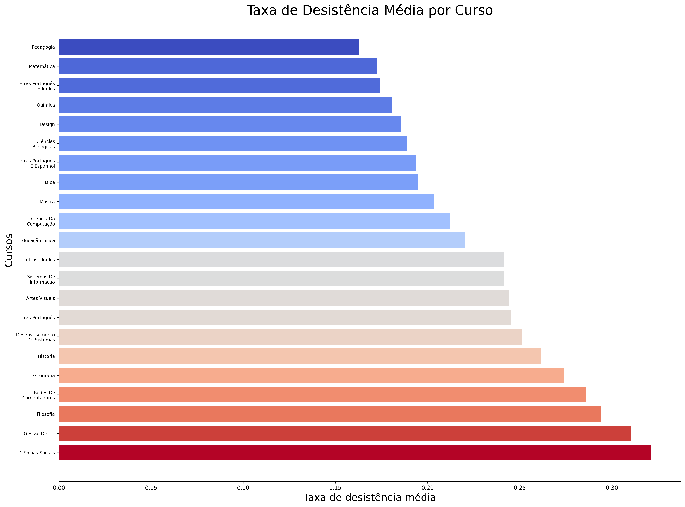
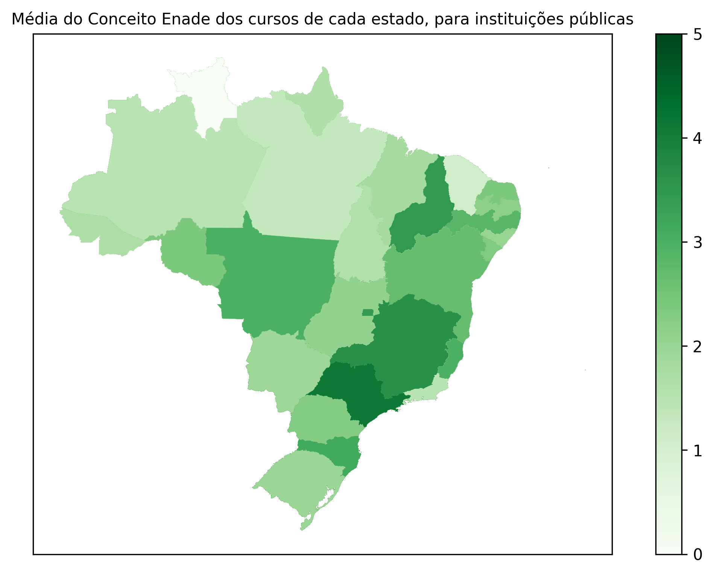
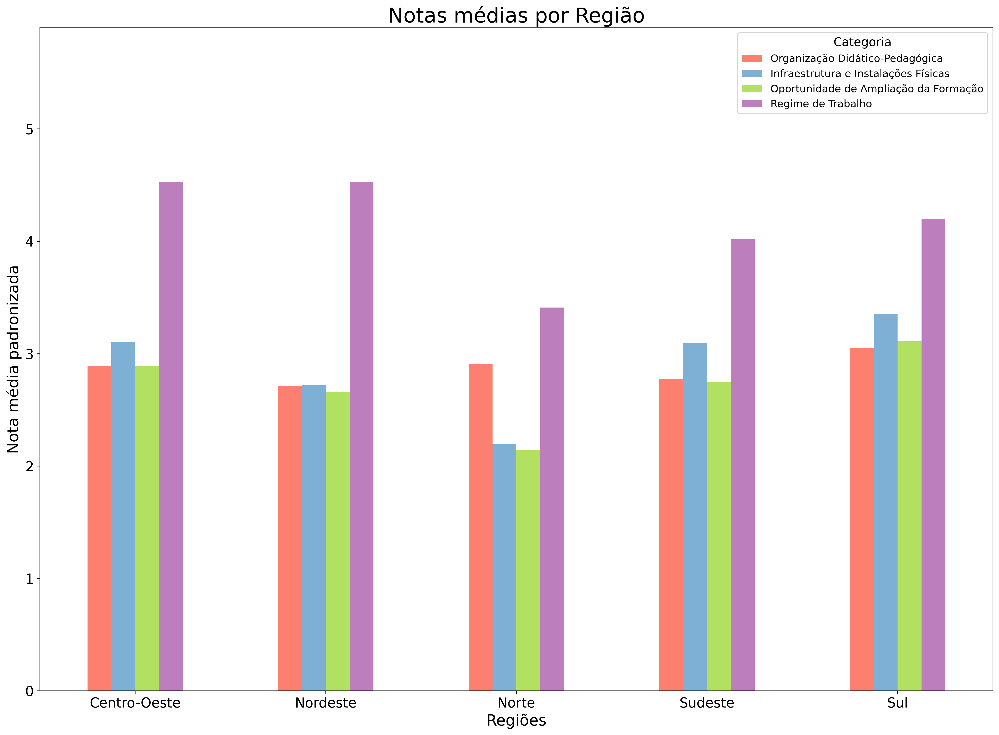

  # Trabalho A1 - Linguagens de Programação

  by Larissa Lemos, Pedro Tokar and Vitor Nascimento

  ## About the project and dataset

  In the present work, we developed analises and their respective visualizations using Pandas and Matplotlib. The data concerns to the CPC (Conceito Preliminar de Curso), an avaliator of undergraduate-level courses offered in universities all over Brazil. 
  The dataset is available at [Brazilian Government's open database](https://dados.gov.br/dados/conjuntos-dados/inep-indice-geral-de-cursos-avaliados-da-instituicao-igc), and it contains data collected in 2021.

  ## Project structure

  Our project is organized into the following modules:

  - `python_scripts`: Contains Python scripts used to extract and parse the dataset, and to create visualizations.
  - `unittests`: Contains Python scripts with unit tests for the `python_scripts` module.
  - `docs`: Includes scripts for generating Sphinx documentation.

  You can see the project documentation and the data analysis here: [Trabalho_LP_A1](https://larissalafonso.github.io/Trabalho_LP_A1/build/html/index.html)

  ## Getting started

  Before getting started, make sure you have installed the most recent version of  `python`.

  ### Prerequisites

  ```sh
    pip install -r requirements.txt
  ```

  ### Installation

  1. Clone the repo

  ```sh
    git clone https://github.com/LarissaLAfonso/Trabalho_LP_A1.git
  ```

  ## Usage

  ### Creating the visualizations

  In order to create the graphs, simply run the `main.py` file.

  ```sh
  python main.py
  ```


  This will generate the following visualizations:


  

  

  

  The visualizations will be saved in the `graphs` folder.

  ### Testing the modules

  To test all the modules created, run:

  ```sh
  python -m unittest discover
  ```

  To test an individual module, run:

  ```sh
  python -m unittests.<test-module-name>
  ```

  ### Creating the documentation

  To update the project's documentation:

  ```sh
  cd docs
  make html
  ```

  The HTML files will be generated in the docs/build folder.

  _For more examples, please refer to the [Documentation](https://larissalafonso.github.io/Trabalho_LP_A1/build/html/py-modindex.html)_
