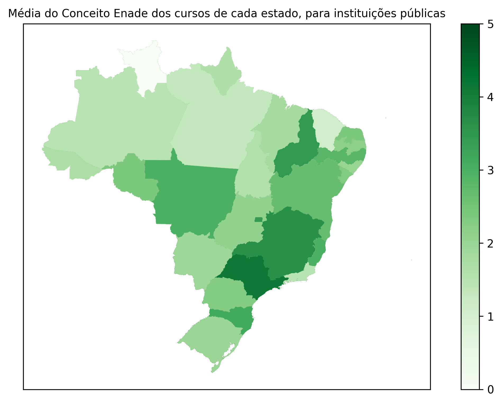

.. _data_analysis_pedro:

Analysis of the Average Enade Grade for Each State - Pedro
==========================================================

The analysis I will do is related to the general Enade grade obtained by courses.

The dataset have two columns related to the grades: " Nota Padronizada - CE" and
" Conceito Enade (Contínuo)". The difference between the two is small, so I chose
to analyze based on the " Conceito Enade (Contínuo)" column.:

>>> import createobjects
>>> import data_cleaner
>>> data_path = "./data/dataframes/resultados_cpc_2021.xlsx"
>>> raw_df = createobjects.load_data_as_df(data_path)
>>> df = data_cleaner.dataframe_cleaner(raw_df)
>>> df[" Conceito Enade (Contínuo)"].mean()
2.400735623003195
>>> df[" Nota Padronizada - CE"].mean()
2.3791958200212995

The means of the two columns are very simillar. As we can see below, the mean
of the differecens between the two columns is ignorable:

>>> (df[" Conceito Enade (Contínuo)"] - df[" Nota Padronizada - CE"]).mean()
0.021539802981895634

For the map plotting, I filtered the data to reflect only public universitys.
We can compare the grade's means for the different university types:

>>> df.groupby("Categoria Administrativa")[" Conceito Enade (Contínuo)"].mean()
Categoria Administrativa
Especial                       1.369682
Privada com fins lucrativos    2.100839
Privada sem fins lucrativos    2.394795
Pública Estadual               2.382922
Pública Federal                2.743884
Pública Municipal              2.078963
>>> df.groupby("Categoria Administrativa")[" Conceito Enade (Contínuo)"].std()
Categoria Administrativa
Especial                       0.740122
Privada com fins lucrativos    0.778820
Privada sem fins lucrativos    0.861284
Pública Estadual               0.915827
Pública Federal                0.954435
Pública Municipal              0.918509

As we can see, they aren't really different; All of them are between 2 and 3.

Now, to the actual plotting, we get the df containing the means for each state:

>>> createobjects.create_mean_of_general_grade(df)
   Sigla da UF    Conceito Enade (Contínuo)
0            AC                    1.978276
1            AL                    1.854321
2            AM                    1.990718
3            AP                    1.965472
4            BA                    2.478058
5            CE                    2.369505
6            DF                    3.557844
7            ES                    3.022967
8            GO                    2.101168
9            MA                    1.968111
10           MG                    2.910275
11           MS                    2.201744
12           MT                    1.885990
13           PA                    1.874467
14           PB                    2.409157
15           PE                    2.322109
16           PI                    2.079104
17           PR                    2.867315
18           RJ                    3.278528
19           RN                    2.665535
20           RO                    1.947105
21           RR                    1.816065
22           RS                    2.894011
23           SC                    3.247607
24           SE                    2.463977
25           SP                    3.201814
26           TO                    1.829220

We can already see that some states excel the others considerably. We will be
able to see that these states are near each other when we plot a map with this
data.

After some mapa data manipulation that isn't related to the actual data analysis,
this is the result:

