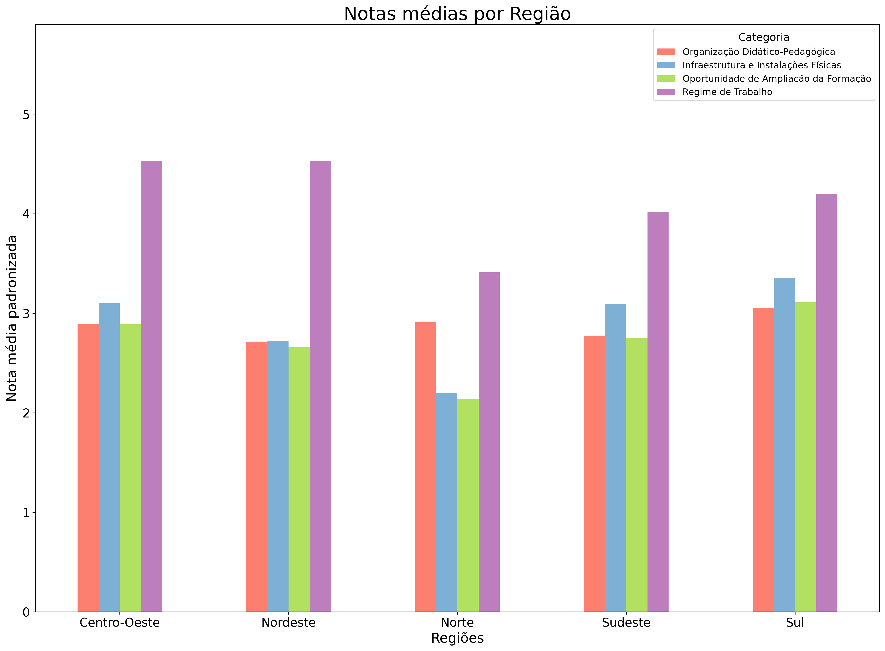

.. _data_analysis_vitor:

Analisys of the Specifics Scores for Each Region in Brazil - Vitor
==================================================================

I decided to analyse the average scores for each evaluation category in every region of Brazil.

I also wanted to verify if there’s a connection between the regions in Brazil and the higher performance in education institutions in the Enade.

>>> import createobjects
>>> import data_cleaner
>>> data_path = "./data/dataframes/resultados_cpc_2021.xlsx"
>>> raw_df = createobjects.load_data_as_df(data_path)
>>> df = data_cleaner.dataframe_cleaner(raw_df)
>>> createobjects.create_average_nota_by_region(df)
                   Organização Didático-Pedagógica         Infraestrutura e Instalações Físicas          Oportunidade de Ampliação da Formação           Regime de Trabalho  
Região                                                                                                                                                                                                                        
Centro-Oeste                              2.890878                                     3.100408                                       2.887566                     4.528085  
Nordeste                                  2.714391                                     2.717979                                       2.656292                     4.529913  
Norte                                     2.907651                                     2.196363                                       2.142814                     3.410240  
Sudeste                                   2.775890                                     3.092782                                       2.750304                     4.018040  
Sul                                       3.050434                                     3.354842                                       3.108503                     4.199876  

While there aren't any start correlations between the Brazilian regions and their Enade, a surprising aspect worth mentioning is that the Southern region acquired the highest scores in almost all avaliation fields. And while that isn't exactly strange since it's one of the richest regions in the country and with greatest quality of life, one would expect for the Southern region to be in the podium: it's the richest region in the country, and the most renowned institutions of undergraduate learning, such as USP and Unicamp, are located there.

It was also unexpected to observe that the Southeastern region fell behind the Central-Western in almost all markers, since it's a region particularly known for its quality of education.
