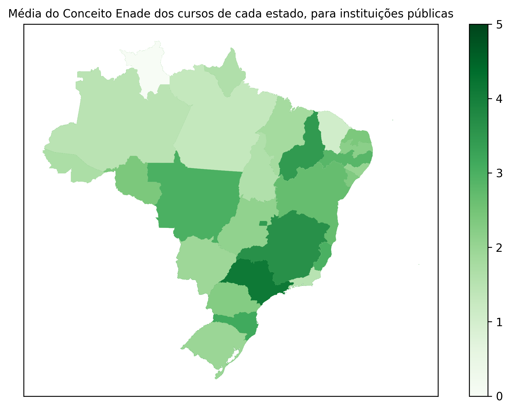

.. _data_analysis_vitor:

Data Analisys - Vitor
=====================

Some text explaning anything
Example:

>>> import createobjects
>>> import data_cleaner
>>> data_path = "./data/dataframes/resultados_cpc_2021.xlsx"
>>> raw_df = createobjects.load_data_as_df(data_path)
>>> df = data_cleaner.dataframe_cleaner(raw_df)
>>> createobjects.create_mean_of_general_grade(df)
   Sigla da UF    Conceito Enade (Contínuo)
0            AC                    1.978276
1            AL                    1.854321
2            AM                    1.990718
3            AP                    1.965472
4            BA                    2.478058
5            CE                    2.369505
6            DF                    3.557844
7            ES                    3.022967
8            GO                    2.101168
9            MA                    1.968111
10           MG                    2.910275
11           MS                    2.201744
12           MT                    1.885990
13           PA                    1.874467
14           PB                    2.409157
15           PE                    2.322109
16           PI                    2.079104
17           PR                    2.867315
18           RJ                    3.278528
19           RN                    2.665535
20           RO                    1.947105
21           RR                    1.816065
22           RS                    2.894011
23           SC                    3.247607
24           SE                    2.463977
25           SP                    3.201814
26           TO                    1.829220

(This is copied from python console)
more explaning, maybe more examples
then the final result is:

